# Proposed database design — M0

**Status: proposed, not applied.** This is an implementation contract for M1 onward, not an Alembic revision, deployed schema, or passing-test claim. Authority: [v6 build specification](spec/CONTENT_OS_ASTRA_BUILD_SPEC_v6.md), especially §§7–16, 18–21. Decision: [ADR 0002](adr/0002-data-and-workers.md). Preservation and verification: [migration plan](MIGRATION_PLAN.md).

Read the full 587-line specification and `backend/models/entities.py`, `database.py`, `services/auth.py`, `services/spend.py`, `services/pipeline.py`, and `services/scheduler.py`. Inspected checkout: branch `engineering/v6-m0-foundation`, commit `d3e3f9934681dcb29e65194f9699566165ccd813`. These are source observations, not production inventory. Other contributors may be writing M0 documents concurrently.

## 1. Observed starting point and design boundary

Current IDs are `String(36)`, timestamps mostly naive, spend and clip seconds floating point. `users` are workspace-local with `(workspace_id,email)` uniqueness and a default `owner` role; there is no verified individual login. `auth.get_workspace` authenticates a workspace API key only. Brand references are nullable and not tenant-composite. `create_all` initializes schema at startup. `replace_scenes` deletes old scene rows. Provider calls happen inside the synchronous pipeline before commits; spend is checked after calls. The spending limit uses a falsy fallback, so explicit zero is not reliably a hard zero. Render jobs have no leases or fencing. Scheduler Redis failure permits execution. Publication selects the newest assembly in the workspace, not the exact video output, and stores apparent publication URLs without an immutable approval subject.

Preserve the old records and identifiers; do not treat the above behavior as v6 authorization or trustworthy live-publication evidence. Introduce an additive `cos_v6` PostgreSQL schema so legacy names can remain in `public` during migration. The names below refer to `cos_v6` unless qualified. SQL snippets illustrate the target contracts; helper functions/triggers described here **must be implemented and tested**, not assumed to exist.

## 2. Physical conventions and ownership invariants

- PostgreSQL is authoritative. Alembic controls DDL; startup must eventually check schema compatibility instead of running `create_all`. SQLite may exercise pure application logic, not concurrency or migration acceptance.
- `id uuid PRIMARY KEY` defaults to `gen_random_uuid()` unless a child uses a composite key. All target IDs are UUID; old strings live in mapping/archive fields, never cast wholesale.
- Notation: **W** means `workspace_id uuid NOT NULL` plus FK to `workspaces(id)` and `UNIQUE(workspace_id,id)`. **B** means W plus `brand_id uuid NOT NULL`, FK `(workspace_id,brand_id) -> brands(workspace_id,id)`, and `UNIQUE(workspace_id,brand_id,id)`. Columns below are **NOT NULL unless marked `?`**. `?` means SQL NULL, not empty-string sentinel. All rows have `created_at timestamptz NOT NULL DEFAULT clock_timestamp()` unless explicitly an association key; mutable rows also have `updated_at timestamptz` and `lock_version bigint DEFAULT 0 CHECK(lock_version>=0)`.
- `ref<T>` is `uuid` and a real FK. For a B child referencing B parent T, use `(workspace_id,brand_id,field) -> T(workspace_id,brand_id,id)`. W-to-W uses `(workspace_id,field)`. B-to-W retains workspace in the FK. No single-ID FK replaces these composites. Optional single references use MATCH SIMPLE; multi-field optional references have all-or-none CHECKs or MATCH FULL on a separate association table. A NULL brand is not a shortcut for unrestricted access.
- Every mutable current pointer also includes its owning aggregate ID: `(workspace_id,brand_id,id,current_version_id) -> *_versions(workspace_id,brand_id,aggregate_id,id)`, DEFERRABLE INITIALLY DEFERRED where circular insertion requires it. Thus a pointer cannot select another asset's version in the same brand.
- UTC `timestamptz`; requested wall time is `timestamp without time zone` plus validated IANA zone and UTC instant. Editorial time is `bigint` milliseconds. FPS is positive integer numerator/denominator. Hashes are `bytea CHECK(octet_length(hash)=32)` (SHA-256), not a signed URL.
- Monetary currency is `text CHECK(currency ~ '^[A-Z]{3}$')`; money is signed `bigint` micro-units (1 USD = 1,000,000). Nonnegative checks apply to limits/reservations, not immutable refund/adjustment entries. Guard overflow in SQL arithmetic using `numeric` comparisons before bigint storage. FX is not implicit. Customer credits use a separate signed integer `amount_units`, `unit=credits`, `ledger_dimension=CUSTOMER_CREDITS` and **SQL NULL currency**; they are not Money, USD, zero-valued money or implicitly convertible into provider cost.
- Checked `text` statuses (named CHECK or reference code tables) permit additive deployment; not arbitrary free-form status strings. JSONB stores schema-versioned content/configuration, **not referential integrity**. Every executable/reference-bearing ID in JSON has a normalized FK-bearing row or column. Commit-time validator verifies JSON and normalized projections agree.
- Default deletion is `ON DELETE RESTRICT`/NO ACTION. No cascading deletion of versions, approvals, jobs, attempts, usage or publications. Active identity/workspace/brand tombstones immediately block use. Immutable rows cannot be updated/deleted by API/worker roles. A separate reviewed purge procedure handles retention, object deletion and minimized audit preservation, never normal ORM cascade. Ephemeral session deletion is an explicit exception.
- In compact catalog cells, an untyped local `*_id`/`*_key` reference is UUID unless explicitly labeled a text key; `*_at`, `due_at`, `period_start/end` and `effective_at` are timestamptz; `version_no`/`revision_no` are positive integers; kind/state/scope/reason/from_state/to_state are checked text. Explicit types override this shorthand. Every wider composite FK mentioned below requires the corresponding named UNIQUE key on its parent (for example `(B,id,asset_version_id)` on renditions and `(B,id,subject_id)` on review_tasks), not merely uniqueness of the UUID alone.
- Index all child FK prefixes. B operational tables get `(workspace_id,brand_id,status,created_at,id)` where status exists. Time-ordered pages use `(workspace_id,brand_id,created_at,id)`; specific queue/graph/metric indexes appear below. Do not index large JSON indiscriminately.

### 2.1 Membership and brand authorization are more than FKs

A valid tenant FK does not grant access. API read/write queries, workers, signed object access and export use authenticated **user ID + active membership + explicit brand grant**. Owner bypasses brand grants only within their owned workspace. Every non-owner, including admin, requires a grant for brand content. Owner/admin global management capability is separate from content access. Roles combine; editorial approver is owner/admin/reviewer, publication actor owner/admin/publisher, editor cannot approve without another role. Connecting accounts additionally requires the grant's `can_connect` capability where publisher is used.

Use narrowly scoped security-definer mutation procedures with a fixed `search_path`, parameterized verified actor context, and no arbitrary actor ID from a request body. Revoke direct DML on ownership, memberships, grants, approvals, budgets and dispatch tables from the application role. Ordinary tenant tables additionally use `ENABLE/FORCE ROW LEVEL SECURITY` under a non-owner, non-BYPASSRLS runtime role. `USING` and `WITH CHECK` both require active tenant/brand access; missing context denies. Tenant context is transaction-local, established only by trusted API/worker plumbing; custom GUC values alone are not cryptographic authentication. Workers use a scoped work authorization linked to the original actor, never a global tenant bypass. Tests must cover pooled connection context reset and SECURITY DEFINER routines not accidentally bypassing authorization.

Ownership is stored in `workspaces.owner_membership_id`, **not** a grantable `owner` value in the roles array. A deferred constraint checks it refers to an ACTIVE membership of that workspace, with a verified active user. Active workspaces require exactly one pointer. Only owner-transfer procedure (current owner authorization and acceptance by target) changes it; admin role mutation excludes ownership. Revoking/suspending/deleting the pointed membership fails until an authorized transfer or workspace suspension. Workspace/membership/grant rows are locked in a consistent order during authorization-sensitive mutations. Record actor, previous and next rights, and reason in audit. No onboarding flow invents the first owner.

## 3. Immutable typed version registry and dependency graph

### 3.1 Registry with total subtype integrity

`version_registry` is a **B** table containing `id`, `kind text`, `schema_version int CHECK(>0)`, `content_hash bytea`, `snapshot jsonb`, `created_by_membership_id ref<workspace_memberships>?`, `origin text` (`USER`, `JOB`, `LEGACY_IMPORT`, `FIXTURE`), `sealed boolean DEFAULT false`, and `sealed_at timestamptz?`; `UNIQUE(workspace_id,brand_id,id,kind)`. A job/import origin has a non-user provenance row; NULL is never interpreted as a human approver. Registry kinds are a finite allowlist:

`brand_profile`, `source`, `transcript`, `evidence`, `claim`, `package`, `plan`, `asset`, `rendition`, `timeline`, `media`, `persona`, `recipe`, `voice_sample`, `clip_selection`, `caption_track`, `brand_template`, `render_preset`, `destination_profile`, `publication_revision`.

Each kind has **one concrete table** (`brand_profile_versions`, `source_versions`, `transcript_versions`, `evidence_items`, `claims`, `content_package_versions`, `asset_plan_versions`, `asset_versions`, `renditions`, `timeline_versions`, `media_versions`, `persona_versions`, `recipe_versions`, `voice_sample_versions`, `clip_selection_versions`, `caption_track_versions`, `brand_template_versions`, `render_preset_versions`, `destination_profile_versions`, `publication_revisions`). Its `id` is also its registry ID and PK, and a stored/generated `kind` constant plus composite FK references the registry including kind. The table is not free to change its discriminator. `script_versions` is instead an immutable **extension of `asset_versions` sharing its PK**, required exactly when the owning `assets.type=SCRIPT`; it is not a second registry subtype and has no `script` registry kind. Deferred total-integrity checks require that extension for SCRIPT and forbid it for non-SCRIPT assets. Its children seal under the same asset registry row.

A **DEFERRABLE INITIALLY DEFERRED constraint trigger** on registry insert/update and every subtype insert/update/delete checks the final transaction state: exactly one matching subtype exists, no mismatched subtype exists, registry is sealed, and normalized child references match the snapshot. Dispatch uses only committed sealed versions. A forward subtype FK alone is insufficient: without the reverse existence check an orphan registry row would satisfy review/dependency FKs. Constraint triggers must look up the current row, not only the queued NEW row, after sealing. All mandatory children/reference checks run at seal and at deferred commit.

Version construction happens through one database routine: insert unsealed registry, insert concrete subtype and normalized immutable children/edges, validate, compute canonical hash, seal, commit. Prevent a committed unsealed row. AFTER sealing, reject changes to registry/subtype and additions/updates/deletes of snapshot children/edges; change requires a new version. Child DML locks its owning registry row and rejects sealed=true. Sealing locks that same row, serializing concurrent child insertion. Only construction routine has direct write privileges; an API must not hold an unsealed object across requests. Mutable extraction/validation/review/freshness projections live in separate tables, never mutate snapshot bytes.

Representative FK shape (tables omitted are defined in the catalog):

```sql
-- Proposed DDL pattern, not an applied migration.
CREATE TABLE cos_v6.dependency_edges (
  workspace_id uuid NOT NULL,
  brand_id uuid NOT NULL,
  consumer_version_id uuid NOT NULL,
  consumer_kind text NOT NULL,
  prerequisite_version_id uuid NOT NULL,
  prerequisite_kind text NOT NULL,
  relation text NOT NULL,
  PRIMARY KEY(workspace_id,brand_id,consumer_version_id,
              prerequisite_version_id,relation),
  FOREIGN KEY(workspace_id,brand_id,consumer_version_id,consumer_kind)
    REFERENCES cos_v6.version_registry(workspace_id,brand_id,id,kind),
  FOREIGN KEY(workspace_id,brand_id,prerequisite_version_id,prerequisite_kind)
    REFERENCES cos_v6.version_registry(workspace_id,brand_id,id,kind),
  FOREIGN KEY(consumer_kind,relation,prerequisite_kind)
    REFERENCES cos_v6.dependency_types(consumer_kind,relation,prerequisite_kind),
  CHECK(consumer_version_id <> prerequisite_version_id)
);
CREATE INDEX dependency_reverse ON cos_v6.dependency_edges
  (workspace_id,brand_id,prerequisite_version_id,consumer_version_id);
```

`dependency_types` is a migration-owned allowlist, not user writable. Examples: package→source/evidence/claim/brand_profile/persona; transcript→source; asset→package/plan/recipe/timeline/asset/clip_selection; publication_revision→asset/rendition; timeline→asset/media/caption_track/brand_template/render_preset; voice_sample→brand_profile/media; clip_selection→asset/rendition/package/transcript/destination_profile; rendition→asset/destination_profile/media. Script dependencies use prerequisite/consumer kind `asset` with a SCRIPT asset-type/extension check on the relevant endpoint, never kind `script`. Relation-specific validators distinguish `narration_script` from `base_asset` or `derived_from_final_cut` on asset→asset/timeline→asset links. Enumerate **relation** too, e.g. `derived_from_final_cut`, not just arbitrary kind pairs. New pairs require tests and a migration. Typed columns and graph edges mirror each other and the seal validator rejects missing or extra authoritative lineage.

### 3.2 Acyclicity and changes

Direction is **consumer → prerequisite**. Before inserting edge C→P, reject if P reaches C. Use a `brand_graph_locks(workspace_id,brand_id PRIMARY KEY,epoch bigint)` row. The construction/invalidation transaction first takes `SELECT ... FOR UPDATE` on that row in a separate statement, then runs graph queries at READ COMMITTED (fresh statement snapshot). All edge-writing routines obey this; revoke unrestricted inserts. A trigger-only advisory lock acquired after a statement snapshot is not sufficient under concurrent write skew. A REPEATABLE READ caller must be rejected or use SERIALIZABLE with whole-transaction retries. Seal/reachability constraint triggers are additional defense, not a replacement for serialization. Reject self-edges, multi-hop cycles, cycles inside a batch, and concurrent C→P/P→C. Prerequisites must already be sealed, or be part of the same validated transaction batch.

```sql
-- Under the brand graph row lock, before adding :consumer -> :prerequisite:
WITH RECURSIVE reachable(id) AS (
  SELECT CAST(:prerequisite AS uuid)
  UNION
  SELECT e.prerequisite_version_id
  FROM cos_v6.dependency_edges e JOIN reachable r ON e.consumer_version_id=r.id
  WHERE e.workspace_id=:ws AND e.brand_id=:brand
)
SELECT EXISTS(SELECT 1 FROM reachable WHERE id=:consumer) AS reject_cycle;
```

`version_status` (**B**, `version_id ref<version_registry> UNIQUE`, `production_status text`, `approval_status text`, `rights_status text`, `freshness text`, `reason text?`, `evaluated_at timestamptz`, lock version) is a mutable projection, not authority. `version_invalidations` (**B**, `affected_version_id`, `trigger_version_id?`, `reason`, `occurred_at`, `event_id uuid UNIQUE`) is append-only. On a current-pointer revision, under graph lock traverse reverse edges and insert invalidations; pause affected unpublished publications and emit outbox events in the same transaction. Large fanout can enqueue expansion but **must synchronously set a brand invalidation epoch barrier**; dispatch blocks until dependency validation catches up. At dispatch compare all dependency currentness/revocation predicates, not only cached approval status. Live publications keep their old content and approvals; create correction/takedown review tasks. Finishing an old job is allowed but never transfers approval to the new version.

Avoid circular ownership/lineage: timeline input **`base_asset_version_id`** pins the already sealed version being edited, belonging to the project's asset; it is a distinct input dependency included in the timeline hash. `timeline_versions` references that base, its video project and script/media inputs, **not the new asset version it produces**. In one transaction the server constructs/seals the timeline, creates a **new** `asset_versions` output pointing to it, inserts `video_asset_bindings`, and CAS-updates current pointers under the required ETag. API response **`asset_version_id`** is that newly created output binding; it is not accepted as the input base and is excluded from timeline canonical content/hash/dependency edges. Failure rolls back timeline, output and pointers together. `video_projects` points to stable `assets`. This explicit relational interpretation of §12.2 avoids asset↔timeline cycles and response/input identity confusion.

## 4. Entity catalog (all §8.2 groups)

The common W/B, PK, timestamps, nullability and composite FK rules in §2 apply to **every** row below. `V` denotes a B registry subtype with `id=version_registry.id`, fixed kind, and seal/immutability checks from §3. Mutable aggregate version tables include `aggregate_id`, `version_no int CHECK(>0)`, `UNIQUE(workspace_id,brand_id,aggregate_id,version_no)` and `UNIQUE(workspace_id,brand_id,aggregate_id,id)`; aggregate-specific owner column replaces `aggregate_id` in actual DDL. Immutable children have an owning-version FK and are sealed with it.

### 4.1 Identity, tenants, campaigns

| Table / scope | Columns beyond common conventions | Keys and invariants |
|---|---|---|
| users / global | `display_name text`, `status text`, `verified_at timestamptz?`, `deleted_at timestamptz?` | Global person, not workspace key or email principal. |
| user_identities / global | `user_id ref<users>`, `issuer text`, `subject text`, `email text?`, `email_verified boolean`, `authenticated_at timestamptz` | UNIQUE(issuer,subject); email non-unique, non-authoritative for linking. Link identities only via verified ownership flow. |
| workspaces / root | `name text`, `timezone text`, `state text`, `owner_membership_id uuid?`, `deleted_at timestamptz?`, `auth_epoch bigint DEFAULT 0` | owner composite FK `(id,owner_membership_id)` to membership `(workspace_id,id)` deferred. NULL owner permitted only `PENDING_ONBOARDING`, `LEGACY_UNCLAIMED` or `SUSPENDED`, never ACTIVE. |
| workspace_memberships / W | `user_id ref<users>`, `roles text[]`, `state text`, `verified_at timestamptz?`, `revoked_at timestamptz?` | UNIQUE(workspace_id,user_id); roles subset `{admin,editor,reviewer,publisher,viewer}`, no owner; no duplicate roles. Historical rows retained. |
| brand_grants / B | `membership_id ref<workspace_memberships>`, `state text`, `can_connect boolean DEFAULT false`, `granted_by_membership_id ref<workspace_memberships>`, `revoked_at timestamptz?` | UNIQUE(workspace_id,brand_id,membership_id); grant tenant constrained; active membership required for use, owner/admin authorized mutations only. |
| invitations / W | `intended_issuer text?`, `intended_subject text?`, `intended_email text?`, `token_hash bytea`, `expires_at timestamptz`, `state text`, `created_by_membership_id`, `accepted_identity_id ref<user_identities>?` | Token unique; default expiry 7 days. Verified intended identity, not bare email equality; acceptance stores proof. Roles/brands in normalized proposed grants validated on accept. |
| sessions / global | `user_id`, `token_hash bytea UNIQUE`, `expires_at`, `revoked_at?`, `csrf_secret_hash bytea` | HttpOnly browser token not DB identity; no clear token. |
| api_credentials / W | `key_hash bytea UNIQUE`, `prefix text`, `principal_type text`, `membership_id?`, `state text`, `expires_at?`, `revoked_at?`, `scopes text[]` | Legacy workspace key is distinct restricted principal, no human approval or owner actions; per-brand scopes in credential_brand_grants. |
| actor_principals / W immutable identity binding | `user_id ref<users>?`, `credential_id ref<api_credentials>?` | CHECK exactly one non-NULL; credential FK includes workspace; user must have same-workspace membership when used. Partial UNIQUE(workspace_id,user_id) and UNIQUE(workspace_id,credential_id) on their non-NULL branches. No free polymorphic identifier. |
| brands / W | `name text`, `state text`, `current_profile_version_id uuid?`, `policy_epoch bigint DEFAULT 0`, `deleted_at?` | profile pointer composite includes brand identity. NULL only before initial profile. |
| brand_profile_versions / V | `brand_owner_id ref<brands>`, `version_no int`, `voice jsonb`, `visuals jsonb`, `policy jsonb`, `pronunciations jsonb`, `sample_text text?` | Require brand_owner_id=brand_id. Policy snapshot includes prohibited terms, reviewer policy, audience, offers and CTAs; references to users/reviewers normalized. |
| brand_reviewers / B | `profile_version_id`, `membership_id`, `scope text` | Immutable per-profile selection; membership same workspace, active brand grant rechecked at decision and dispatch. Labels such as Tailor Law are not authorization rules. |
| campaigns / B | `name text`, `objective text`, `audience text`, `offer jsonb?`, `primary_cta jsonb?`, `jurisdiction text?`, `status text`, `created_by_membership_id?` | Controlled Standalone aggregate allowed; provenance required if imported. State set per §13, not one failed child hiding others. |
| personas + persona_versions / B, V | aggregate `name,current_version_id?`; version `persona_id,version_no,description text,tone text,audience text` | Brand-pinned snapshots; legacy unbranded personas remain quarantined until scoped. |

`entitlements` is defined in §4.9. Mutable actor authorization is never inferred from immutable role snapshots; those snapshots document what was checked historically.

### 4.2 Sources, transcripts, evidence and claims

| Table / scope | Columns | Keys and rules |
|---|---|---|
| source_assets / B | `campaign_id?`, `source_type text`, `title text`, `current_version_id?`, `created_by_membership_id?`, `deleted_at?` | Logical source; no cross-brand dedup disclosure. |
| source_versions / V | `source_asset_id,version_no`, `original_uri text?`, `object_key text?`, `sha256 bytea?`, `mime_type text`, `size_bytes bigint?`, `rights_assertion jsonb`, `captured_at timestamptz`, `source_snapshot jsonb`, `media_version_id ref<media_versions>?` | At least URI, object key or inline snapshot content. Inline text hashes computed at seal; unknown legacy hash explicit quarantine. Authoritative usable object has size/hash. Private object key, never expiring signed URL. |
| upload_intents / B | `source_asset_id`, `storage_upload_id text`, `quarantine_key text`, `expected_size bigint`, `expected_hash bytea?`, `state text`, `expires_at`, `completed_source_version_id?` | Resumable transfer; finalized is not cleared. UNIQUE(workspace_id,brand_id,storage_upload_id). |
| source_processing / B | `source_version_id UNIQUE`, `scan_state text`, `extraction_state text`, `probe_state text`, `error_code text?`, `manifest jsonb?` | Mutable processing state, no editing sealed source. Extracted content change creates new source snapshot/lineage. |
| transcript_versions / V | `source_version_id`, `previous_transcript_version_id?`, `language text`, `provider text`, `provider_model text?`, `alignment_status text`, `alignment_method text?`, `original_transcript_version_id?` | Exact source media; corrected presentation text separate from original spoken record. Root transcription NULL previous/original, corrections must reference root/same source. |
| transcript_segments / immutable B child | `transcript_version_id`, `segment_key uuid`, `speaker_label text?`, `start_ms bigint`, `end_ms bigint`, `spoken_text text`, `presentation_text text`, `confidence numeric(5,4)?`, `original_segment_key uuid?`, `original_transcript_version_id?` | UNIQUE(workspace_id,brand_id,transcript_version_id,segment_key); 0<=start<end<=probed duration, confidence in [0,1]. Original pair all-or-none composite FK to transcript_segments. Split/merge via segment_lineage bridge rather than fabricated one-to-one. |
| segment_lineage / immutable B child | `transcript_version_id,segment_key,original_transcript_version_id,original_segment_key` | Both endpoints real composite segment FKs; same source; preserves many-to-many corrections. |
| evidence_items / V | `source_version_id`, `locator jsonb`, `quote text?`, `title text`, `retrieved_at timestamptz`, `url text?`, `permitted_excerpt text?` | Stable locator is page/paragraph/time range; URL alone does not prove retrieval. Reviewer evidence is captured as a source snapshot, not a bypass FK. |
| claims / V | `claim_key uuid`, `revision_no int`, `text text`, `class text`, `verification_state text`, `severity text`, `jurisdiction text?`, `reason text?` | Classes factual/quotation/opinion/personal_anecdote; verification unreviewed/supported/unsupported/contradicted/expired. Changes are new immutable claim records. UNIQUE(B,claim_key,revision_no). |
| claim_evidence_links / immutable B child | `claim_id`, `evidence_item_id`, `relationship text`, `reviewer_membership_id?`, `reviewed_at?`, `reason text?` | PK(B,claim_id,evidence_item_id,relationship); exact claim and evidence FKs. Seal blocks `supported` without retrievable source or authenticated explicit reviewer evidence. No fabricated evidence validation. |

Alignment changes create a new transcript version or append an alignment validation result bound to unchanged content; do not rewrite historical timings. Clip jobs require valid timing or explicit recorded manual confirmation, and approved package/final cut lineage, not transcript-only approval. Source validation failures and untrusted extracted instructions cannot change permission rows.

### 4.3 Packages, executable plans, assets and rendition profiles

| Table / scope | Columns | Keys and rules |
|---|---|---|
| content_packages / B | `campaign_id`, `title text`, `current_version_id?` | Logical strategy package. |
| content_package_versions / V | `content_package_id,version_no`, `brand_profile_version_id`, `persona_version_id?`, `title text`, `primary_thesis text`, `business_objective text`, `target_audience text`, `funnel_stage text`, `offer jsonb?`, `primary_cta jsonb?`, `master_narrative text`, `classification text` | Canonical §8.3 snapshot. Source-free opinion explicitly allowed; factual claims need evidence. No dummy offer IDs. |
| package_sources / immutable B child | `package_version_id,source_version_id` | PK(B,both refs). |
| package_claims / immutable B child | `package_version_id,claim_id` | PK(B,both refs); claim versions exact. |
| content_atoms / immutable B child | `package_version_id`, `atom_key uuid`, `type text`, `text text`, `position int` | UNIQUE(B,package_version_id,atom_key). Atom source/evidence links use atom_sources/atom_evidence bridges; seal hash includes ordered atoms. |
| asset_plans / B | `campaign_id`, `current_version_id?` | A plan revision does not overwrite approved work. |
| asset_plan_versions / V | `asset_plan_id,version_no`, `package_version_id`, `estimate_low_micros bigint`, `estimate_high_micros bigint`, `budget_ceiling_micros bigint`, `currency text`, `price_snapshot_at timestamptz` | 0<=low<=high; ceiling>=0; approval in decisions, not a mutable boolean here. |
| plan_items / immutable B child | `plan_version_id`, `item_key uuid`, `asset_type text`, `recipe_version_id`, `destination_set text[]`, `rationale text`, `constraints jsonb`, `estimate_low_micros bigint`, `estimate_high_micros bigint`, `selected boolean`, `disposition text` | UNIQUE(B,plan_version_id,item_key); selected/deferred/removed encoded in snapshot. Currency inherited from plan. |
| plan_item_prerequisites / immutable B child | `plan_version_id,item_key,prerequisite_item_key` | Two composite FKs within same plan; acyclic item DAG, no self-edge. Future output uses item identity, not a nonexistent version UUID. |
| plan_item_inputs / immutable B child | `plan_version_id,item_key,input_version_id,input_kind,role text` | Item FK plus typed registry FK; required known inputs pinned. Execution resolution records actual produced version in job_inputs before dependent step dispatch. |
| assets / B | `campaign_id`, `type text`, `title text`, `current_version_id?`, `deleted_at?` | Universal identity uses the API AssetType allowlist: MAIN_VIDEO, CLIP, LINKEDIN_POST, ARTICLE, NEWSLETTER, SCRIPT, CAPTIONS, THUMBNAIL. SCRIPT is not a separate aggregate outside assets. Type/content and required extension compatibility enforced on versions; any later archive/image type needs a matching API/schema migration before enablement. |
| asset_versions / V | `asset_id,version_no`, `package_version_id`, `plan_version_id?`, `plan_item_key?`, `recipe_version_id?`, `script_version_id?`, `timeline_version_id?`, `content jsonb`, `edit_origin text`, `diff jsonb?` | Optional plan pair all-or-none same-plan FK. Manual asset creation can omit a plan; paid production execution cannot. Pre-plan drafting/proposal creates package/plan outputs under the bounded authorization in §4.5, never an implicit production-plan exemption. Locked blocks represented as immutable block rows with stable key, content hash and locked flag. |
| renditions / V | `asset_version_id`, `destination_profile_version_id`, `media_version_id`, `delivery_settings jsonb`, `render_input_hash bytea` | Immutable rendition with exact asset + file; UNIQUE(B,asset_version_id,destination_profile_version_id,render_input_hash). Multiple compatible platforms can use same file; publication metadata stays distinct. |
| rendition_validations / B append-only | `rendition_id`, `validator_version text`, `state text`, `report jsonb`, `measured_at timestamptz` | Decoding, dimensions, duration, captions, audio/loudness results distinct from human acceptance. Latest valid report is revalidated on profile changes. |
| recipe_versions / V | `recipe_key text`, `revision_no int`, `output_type text`, `prompt_template text`, `output_schema jsonb`, `provider_requirements jsonb` | UNIQUE(B,recipe_key,revision_no); platform defaults copied as pinned brand-local snapshots, no cross-tenant FK. |
| destination_profile_versions / V | `platform text`, `revision_no int`, `constraints jsonb`, `verified_at timestamptz`, `official_reference text` | Duration/formats/safe zones/account capabilities versioned, not universal hard-coded limits. |

Asset semantic approval and concrete rendition approval are distinct scopes. Written assets can be approved and exported without video, avatar, rendition, or social connection. When an archive asset type is enabled across contracts, its immutable manifest lists exact versions using `archive_members` composite FK rows; archive availability/expiry is mutable object lifecycle, never publication state.

### 4.4 Video projects, scenes, shots, media rights and consent

| Table / scope | Columns | Keys and rules |
|---|---|---|
| video_projects / B | `asset_id ref<assets> UNIQUE within B`, `current_script_version_id?`, `current_timeline_version_id?`, `route text` | Route human_preserve/human_edit/avatar. Pointer constraints include project ID. |
| video_asset_bindings / immutable B | `video_project_id,asset_version_id,timeline_version_id?` | PK(B,video_project_id,asset_version_id), UNIQUE(B,asset_version_id); verify asset version belongs to project's asset and pins same timeline. |
| script_versions / immutable B extension of asset_versions | `id ref<asset_versions> PRIMARY KEY`, `video_project_id?`, `persona_version_id?`, `narration text`, `pronunciation jsonb` | Same `(B,id)` PK/FK as asset_versions; owning asset MUST have `type=SCRIPT`. Asset identity/version number/package/recipe inherited from asset_versions, not duplicated authorities. Optional project attachment permits standalone scripts; project current script pointer includes project identity. Exact asset/narration approval before avatar spending. |
| scenes / immutable B child | `script_version_id`, `scene_key uuid`, `position int`, `narration text`, `visual_direction text`, `locked boolean`, `content_hash bytea` | UNIQUE(B,script_version_id,scene_key), UNIQUE(B,script_version_id,position); new script copies unchanged locked scene payload. No delete/replace on sealed parent. |
| timeline_versions / V | `video_project_id,version_no`, `base_asset_version_id`, `script_version_id?`, `duration_ms bigint`, `width int`, `height int`, `fps_num int`, `fps_den int`, `caption_track_version_id?`, `brand_template_version_id?`, `render_preset_version_id` | Positive durations/dimensions/FPS. Human preserve route may omit script. Base must be an existing sealed version of the project's asset; output asset_version_id is a separate server-created response binding excluded from the timeline hash. |
| timeline_tracks / immutable B child | `timeline_version_id`, `track_key text`, `kind text`, `z_index int` | PK(B,timeline_version_id,track_key). |
| shots / immutable B child | `timeline_version_id,track_key`, `shot_key uuid`, `scene_script_version_id?`, `scene_key?`, `media_version_id`, `start_ms bigint`, `duration_ms bigint`, `source_in_ms bigint`, `fit text`, `focal_x numeric(7,6)`, `focal_y numeric(7,6)`, `gain_db numeric(7,3)` | Track FK; scene pair all-or-none composite FK. 0<=start, 0<duration, 0<=source_in; end<=timeline; source range<=actual media duration at seal; focal in [0,1]. Stable shot keys copied across revisions. |
| clip_selections / B aggregate | `campaign_id`, `current_version_id?` | Stable API `selection_id`; owning-aggregate composite current-version FK. Not a child that exists only after clip output. |
| clip_selection_versions / V (kind clip_selection) | `clip_selection_id,version_no`, `final_cut_asset_version_id`, `final_cut_rendition_id`, `package_version_id`, `transcript_version_id?`, `shortfall_reason text?` | API selection_version_id = registry ID; approved independently before clip production. Exact final-cut rendition belongs to pinned final-cut asset version; same approved package or explicit reviewed derivation; normalized moment children and dependencies sealed together. Shortfall needs a separate explicit review decision, never padding clips. |
| clip_selection_moments / immutable B child | `clip_selection_version_id`, `moment_key uuid`, `source_in_ms bigint`, `source_out_ms bigint`, `rationale text`, `crop jsonb`, `destination_profile_version_id`, `destinations text[]` | UNIQUE(B,clip_selection_version_id,moment_key); 0<=in<out<=actual final-cut duration. Edits create a new selection version and fresh approval. Produced CLIP asset links the exact approved selection version/moment through clip_asset_selections. |
| voice_samples / B aggregate | `current_version_id?`, `title text` | Stable API sample_id; owning-aggregate composite current-version FK. No dummy campaign or production plan needed for brand voice preview. |
| voice_sample_versions / V (kind voice_sample) | `voice_sample_id,version_no`, `brand_profile_version_id`, `paragraph text`, `script text`, `media_version_id?`, `provider_attempt_id?`, `preview_configuration jsonb` | API sample_version_id = registry ID. Immutable exact preview result (text and optional media), normalized consent/media refs when applicable, stable aggregate retained across revisions. Paid preview requires preproduction_authorization; sample review grants no production or narration-spend authority. |
| caption_track_versions / V | `transcript_version_id?`, `language text`, `style jsonb`, `cues jsonb` | Normalized caption_cues with `track_version_id,cue_key,start_ms,end_ms,text,source_segment_key?`; reference pair to exact transcript segment if present. Validate bounds; edits create version. |
| brand_template_versions / V | `template_key text`, `revision_no int`, `layout jsonb`, `font_manifest jsonb` | Media/font references normalized into template_media. |
| render_preset_versions / V | `preset_key text`, `revision_no int`, `settings jsonb`, `target_lufs numeric(5,2)`, `true_peak_db numeric(5,2)` | Default -16 LUFS, <=-1 dBTP subject to profile validation. |
| media_assets / B | `kind text`, `title text`, `current_version_id?`, `provenance text`, `deleted_at?` | Logical media file family; never substitutes universal output asset. |
| media_versions / V | `media_asset_id,version_no`, `object_key text?`, `origin_uri text?`, `sha256 bytea?`, `size_bytes bigint?`, `mime_type text`, `duration_ms bigint?`, `width int?`, `height int?`, `fps_num int?`, `fps_den int?`, `provider_attempt_id?`, `generation_prompt text?`, `provenance text`, `execution_mode text` | Usable uploaded/generated file requires immutable object key/hash/size and measured properties. Legacy unknown objects are quarantined, not falsely hash-complete. No self-cycle: provider outputs refer attempt, job inputs pin earlier versions. |
| media_rights / B append-only | `media_version_id`, `rights_key uuid`, `revision_no int`, `permitted_uses text[]`, `license_source text`, `artifact_source_version_id?`, `valid_from timestamptz`, `expires_at?`, `supersedes_id?`, `recorded_by_membership_id?` | UNIQUE(B,rights_key,revision_no). Revocations in rights_events; approval cannot override expiry or missing provenance. |
| consent_records / B append-only | `consent_key uuid`, `revision_no int`, `subject_reference text`, `provider text?`, `avatar_remote_id text?`, `voice_remote_id text?`, `permitted_uses text[]`, `artifact_source_version_id`, `valid_from`, `expires_at?`, `recorded_by_membership_id` | Pseudonymous subject acceptable; actor is verified recorder, not invented subject user. UNIQUE(B,consent_key,revision_no). consent_events records revoke/reinstate with evidence/reason; never overwrite original. |
| media_consents / B | `media_version_id,consent_record_id` | Composite FKs; many-to-many exact consent record binding. |
| avatar_profiles / B | `provider text`, `provider_avatar_id text`, `provider_voice_id text?`, `consent_record_id`, `state text`, `settings jsonb` | Script/plan snapshots pin identifiers and consent, not mutable latest avatar settings. |

Rights/consent changes lock/increment brand policy epoch, invalidate pending use and enqueue live-content review. Recheck before render and publication. Do not claim DB fencing can undo an external action already accepted before revocation (see §7).

### 4.5 Jobs, steps, provider attempts, operation identity

**Execution is W-root, not universally B.** `production_jobs` is the historical table name for all durable jobs. Define **E** as W plus `job_id`, `scope_type text`, nullable `brand_id`/`campaign_id` copied from the job, a `(workspace_id,job_id)` FK and a deferred scope-consistency validator using `IS NOT DISTINCT FROM` for both nullable fields. Root and E children use the same `scope_type`, `purpose`, `job_kind` and `originating_operation_id`; `job_kind` is the database name for API `job_type`. All are checked and immutable after dispatch preparation. Root `scope_type=BRAND` requires brand; campaign is required for production job kinds, optional for allowed preproduction/brand-administration kinds. `scope_type=WORKSPACE` requires NULL brand AND campaign and an explicitly migration-allowlisted administrative job kind (WORKSPACE_EXPORT/requestWorkspaceExport or WORKSPACE_DELETE/requestWorkspaceDeletion, both purpose=ADMIN); owner-only policies remain owner-only, other administration requires owner/admin. `job_scope_types(scope_type,purpose,job_kind,originating_operation_id)` is migration-owned, not inferred from NULL. Every dispatch rechecks resource policy and original actor; global administrative capability is not brand-content access.

All execution links (job↔work authorization, step↔attempt, reservation↔job/step, ledger/inbox/outbox↔attempt/job) use real W composite FKs and validated same-job/scope equality; **do not use a nullable-brand composite FK as the sole execution FK**, because MATCH SIMPLE skips it. A reference to a B row still requires explicit non-NULL reference brand and its B composite FK, plus a current grant/owner/resource-policy check. `job_inputs`/`job_outputs` stay B reference-bearing rows linked to the W job/step: a BRAND job must match its brand; a WORKSPACE job may reference a brand only through an explicit `job_brand_scopes` row validated for that administrative job kind and actor (including owner-only workspace export). A NULL-brand job cannot scan all brands or dispatch production. Brand-bound publication/media/provenance references to E rows additionally validate that exact reference brand and job scope; nullable execution fields never disable the content FK or authorization.

**Two exclusive generation/preparation paid-work authority branches:** PRODUCTION requires the exact approved package/plan and plan ceiling. PREPRODUCTION permits only VOICE_PREVIEW, RESEARCH, TRANSCRIPTION, PACKAGE_DRAFTING and PLAN_PROPOSAL under an explicit immutable `preproduction_authorizations` record. It pins the requesting actor, workspace, required brand and optional campaign/job, exact normalized inputs and SHA-256 hashes, allowed operations, expiry and nonnegative cap/currency; owner/admin approves the exact record/cap using authenticated context. If job is initially absent, first redemption atomically creates a one-job immutable binding and an explicitly authorized JOB cap (zero if none was approved); it cannot be reused for a different job. Approval of the authorization is not editorial approval of eventual outputs. Hash/actor/operation/scope mismatch, expired/revoked authorization, absent cap or zero cap blocks dispatch. No default allowance, hidden research/preview budget, legacy spend fallback or production escape through PREPRODUCTION. New inputs/cap/operation/actor require a new authorization; revocations are append-only events. Pure unpaid local work has authority NONE, zero provider cost and no billable dispatch. Administrative scope alone is never paid authority. For non-production ADMIN/PUBLICATION work, a separately scoped immutable work authorization binds the exact permitted originating operation, actor, inputs and job; configured owner/admin workspace/job and campaign-if-present caps still reserve atomically. Publication additionally requires its exact editorial/media/publication decisions and publisher authority. These branches permit only their named export/deletion/publication operations, never generation, preview, research or render; without an explicit matching work authorization and caps, paid dispatch is denied. No plan or preproduction pointer is fabricated for administration. All paid branches use the same reservation/ledger/outbox/fencing procedures.

| Table / scope | Columns | Keys and rules |
|---|---|---|
| idempotency_records / W | `actor_principal_id uuid`, `operation text`, `key text`, `request_hash bytea`, `logical_operation_id uuid`, `response_status int?`, `response_body jsonb?`, `expires_at?` | UNIQUE(workspace_id,actor_principal_id,operation,key). Composite FK to actor_principals with exactly-one real user/credential FK; different hash=409. Paid/publication identity no seven-day expiry. |
| production_jobs / W root | `scope_type text`, `purpose text`, `job_kind text`, `originating_operation_id text`, `brand_id?`, `campaign_id?`, `paid_authority text`, `plan_version_id?`, `preproduction_authorization_id?`, `requested_by_membership_id?`, `work_authorization_id`, `logical_operation_id uuid`, `status text`, `input_hash bytea`, `execution_mode text`, `cancel_requested_at?` | UNIQUE(workspace_id,logical_operation_id); root scope/job-kind and authority branch checks above. Plan/campaign refs require brand+B FK. Paid job requires verified requester and exact approved authority, not always a plan for preproduction. |
| work_authorizations / E immutable binding | `membership_id?`, `credential_id?`, `purpose text`, `paid_authority text`, `plan_version_id?`, `approval_decision_id?`, `preproduction_authorization_id?`, `auth_epoch bigint`, `policy_epoch bigint?`, `expires_at?` | Exactly one principal; no legacy credential authorization for approval/publish. `(W,job_id)` binds root in deferred creation transaction; job's pointer must reference authorization for itself. Explicit branch/purpose/hash and null-safe scope validation; no trust in epochs alone. Brand approval/plan refs require B FK; policy_epoch NULL only for validated workspace administration. |
| preproduction_authorizations / W immutable | `actor_membership_id`, `approved_by_membership_id`, `brand_id`, `campaign_id?`, `job_id?`, `logical_operation_id uuid`, `originating_operation_id text`, `allowed_operations text[]`, `input_hash bytea`, `canonical_request jsonb`, `cap_micros bigint`, `currency text`, `approved_at`, `expires_at` | UNIQUE(workspace_id,logical_operation_id); originating_operation_id allowlist maps previewBrandVoice→VOICE_PREVIEW, createSourceFromURL→RESEARCH, processSource/alignTranscript→TRANSCRIPTION, draftPackage→PACKAGE_DRAFTING, proposePlan→PLAN_PROPOSAL (including only declared bounded substeps). Verified owner/admin approval, current brand grant for branded content, cap>=0; campaign requires brand+B FK; optional job W FK + scope/actor check. Exact input snapshot and normalized preproduction_authorization_inputs sealed atomically; no future/latest IDs. Human-approval authority not a mutable boolean. |
| preproduction_authorization_jobs / W immutable | `authorization_id`, `job_id` | UNIQUE(W,authorization_id), UNIQUE(W,job_id); exactly one job redemption, created atomically with job/cap; if authorization.job_id present must match. |
| preproduction_authorization_events / W append-only | `authorization_id`, `actor_membership_id`, `event_type text`, `reason text`, `occurred_at` | Owner/admin revoke; no mutation of original cap/hash. Recheck before dispatch; unresolved already-incurred usage still settles. |
| job_inputs / immutable B reference child | `job_id`, `step_id?`, `input_version_id,input_kind`, `role text` | W same-job FK + B typed registry FK and explicit job brand-scope validation above; script input kind is asset with SCRIPT extension check. Step resolved inputs sealed before first intent. No latest lookup. |
| job_steps / E | `step_key text`, `logical_operation_id uuid`, `status text`, `input_hash bytea`, `submission_count int DEFAULT 0`, `next_attempt_at timestamptz`, `lease_owner uuid?`, `lease_expires_at?`, `heartbeat_at?`, `fencing_token bigint DEFAULT 0`, `provider_request_id text?`, `error_class text?`, `estimated_cost_micros bigint`, `actual_cost_micros bigint?`, `currency text` | UNIQUE(W,job_id,step_key), UNIQUE(workspace_id,logical_operation_id), UNIQUE(W,job_id,id). Lease pair all-or-none; token monotonic. Same-job dependencies use W composite FKs, never skipped nullable brand keys. |
| provider_attempts / E | `step_id`, `attempt_no int`, `logical_operation_id uuid`, `provider text`, `provider_account_key text`, `execution_mode text`, `provider_dedupe_key text?`, `request_hash bytea`, `intent_at`, `sent_at?`, `request_id text?`, `state text`, `claim_token bigint`, `response_hash bytea?`, `error_class text?`, `estimated_cost_micros bigint`, `actual_cost_micros bigint?`, `currency text` | UNIQUE(W,step_id,attempt_no); `(W,job_id,step_id)` FK to steps; partial UNIQUE(provider,provider_account_key,execution_mode,request_id) WHERE request_id IS NOT NULL. Scope and logical operation match step. Non-secret verified account identity. Outcome observations append-only; attempt status CAS derived from them. |
| job_outputs / immutable B reference child | `job_id,step_id,output_version_id,output_kind,role text` | W same-job step FK + B typed registry FK and job brand-scope validation. Published only by current fenced transaction. Administrative non-version result URLs do not invent B versions. |
| job_transitions / E append-only | `step_id?`, `from_state,to_state`, `previous_lock_version bigint`, `actor_principal_id?`, `fencing_token bigint?`, `reason text` | W same-job step FK, null-safe scope match; allowed transition matrix; stale worker cannot mutate through alternate tables. |

Add `job_steps(next_attempt_at,id) WHERE status='QUEUED'`, `(lease_expires_at,id) WHERE status IN ('RUNNING','WAITING_PROVIDER','RECONCILING')`, and `(workspace_id,brand_id,job_id,status)`. Waiting provider work releases the active execution lease after persisting remote intent and enqueues a polling/reconciliation step. Poll counts are separate from submission_count; default at most three safe submissions, not three polls. Production jobs are aggregate status; **step** is the atomic work claim/fencing unit.

Dispatch-capable E rows (`work_authorizations`, `job_steps`, `provider_attempts`, `budget_reservations`) also persist the exact `paid_authority`, `plan_version_id?` and `preproduction_authorization_id?` binding. Deferred validation ties these to the root job; PRODUCTION requires only its approved plan, PREPRODUCTION requires only its authorization, ADMIN/PUBLICATION/NONE requires neither and must pass its own purpose/operation policy. Steps/attempts cannot swap authority on retries. `work_authorizations` additionally persists `input_hash bytea` and immutable normalized input bindings; hash, actor, operation and purpose must match its job. Link roles that are credentials to the verified originating actor, never to a broader service identity.

Preproduction authorization creation locks the owner/admin membership, brand policy and explicit budget policy, then constructs immutable authority plus all input children and approval metadata atomically. The record additionally stores `reason text` and `budget_policy_revision bigint`; API created_by maps to approved_by_membership_id's verified user. Direct inserts or later child additions/updates/deletes are forbidden after construction; a deferred completeness/hash validator prevents partially approved committed rows. Redemption does not edit the approved record. PREPRODUCTION account limit can never exceed the immutable authorization cap, nor PLAN account limit its approved plan ceiling; budget-account edits cannot enlarge either authority without a new authorization/approved plan. Worker reservation checks the immutable ceiling as well as counters, so a changed counter is no permission shortcut.

### 4.6 Reviews, approvals, comments

| Table / scope | Columns | Keys and rules |
|---|---|---|
| review_subjects / B immutable | `version_id`, `version_kind text`, `scope text`, `subject_hash bytea` | UNIQUE(B,version_id,scope); typed registry FK and `(version_kind,scope)` FK to migration-owned review_scope_types. Hash covers immutable subject/scope. UPDATE/DELETE forbidden; no retargeting after creation. No `subject_type + arbitrary UUID` loophole. |
| review_tasks / B | `subject_id`, `assigned_membership_id?`, `status text`, `due_at?`, `requested_by_membership_id?`, `reason text?` | Mutable pending work; assignment has grant/reviewer checks. Reopening doesn't rewrite old decision. |
| approval_decisions / B append-only | `subject_id`, `task_id?`, `actor_membership_id`, `decision text`, `prior_decision_id ref<approval_decisions>?`, `decided_at`, `reason text?`, `policy_version_id ref<brand_profile_versions>`, `subject_hash bytea`, `authorization_snapshot jsonb` | Decision APPROVE/REJECT/REVOKE; exact scope subject FK; task composite `(B,task_id,subject_id)` consistency. Trigger checks human, live role/grant/designation and hash. REVOKE references prior_decision_id on same subject. |
| comments / B | `subject_id`, `author_membership_id`, `body text`, `anchor_type text`, `anchor jsonb`, `resolved_at?`, `resolved_by_membership_id?` | Anchors text block/scene/timecode; normalized comment_scene_anchors/comment_segment_anchors enforce exact version FK. Plain document anchor checked against snapshot. Changes have comment_revisions append-only; no loss of review history. |
| decision_invalidations / B append-only | `decision_id`, `cause text`, `trigger_version_id?`, `occurred_at` | Does not delete approval; current validity is computed from decision/revocation/invalidation and present rights/freshness. |

Scope allowlist includes package/editorial, plan/production_budget, **asset/narration** (SCRIPT type and script_versions extension required), asset/final_editorial, **rendition/final_media**, voice_sample/brand_voice, clip_selection/clip_selection, publication_revision/publication, transcript/alignment_confirmation, asset/clip_shortfall. API SCRIPT subjects map to asset/narration, not a script registry kind. VOICE_SAMPLE and CLIP_SELECTION map to their independent registry kinds and exact versions; RENDITION maps to rendition/final_media through its exact approval scope/endpoint, not merely asset final approval. Preproduction cap approval is the separate owner/admin authorization record, never editorial reviewer authority to grant spending. There is **no** scope granting generic approval of a mutable aggregate or arbitrary typed object. Timeline edits create a new timeline and asset version, then new rendition; final asset/media approval applies to exact returned content, not the old hash. Batch UI writes one decision per subject. A publication decision cannot reuse a package or asset approval even if actor is identical.

### 4.7 Connections, publication revisions and attempts

| Table / scope | Columns | Keys and rules |
|---|---|---|
| social_connections / B | `platform text`, `remote_account_id text`, `account_type text`, `display_name text`, `state text`, `token_ciphertext bytea?`, `token_key_id text?`, `token_expires_at?`, `scopes text[]`, `capabilities jsonb`, `verified_at?`, `connected_by_membership_id` | Account identity/platform immutable after verification; changing account creates new connection. Refresh tokens do not revise editorial payload. Uniqueness `(B,platform,remote_account_id)`; shared-use requires explicit separately authorized mapping, not nullable brand. |
| oauth_states / B | `initiator_membership_id`, `state_hash bytea UNIQUE`, `pkce_verifier_ciphertext bytea`, `redirect_uri text`, `expires_at`, `consumed_at?` | Bind user/workspace/brand. Server-only secrets, one use. |
| publications / B | `logical_publication_id uuid`, `current_revision_id?`, `active_dispatch_revision_id?`, `state text`, `execution_mode text`, `requested_by_membership_id`, `remote_id text?`, `remote_url text?`, `verified_live_at?`, `lock_version bigint` | UNIQUE(workspace_id,logical_publication_id). Mutable shell; exact revision pointers include publication ID. States §15; live requires verified actual state/visibility and mode LIVE. Simulated/imported apparent live records never PUBLISHED. |
| publication_revisions / V | `publication_id`, `revision_no int`, `asset_version_id`, `rendition_id?`, `connection_id`, `destination_profile_version_id`, `title text?`, `caption text?`, `description text?`, `metadata jsonb`, `tracking_tags jsonb`, `visibility text`, `requested_local_time timestamp`, `timezone text`, `resolved_utc timestamptz`, `utc_offset_seconds int`, `schedule_owner text` | UNIQUE(B,publication_id,revision_no), UNIQUE(B,publication_id,id). Schedule/account/text/thumbnail/tracking/visibility changes create new version. Rendition FK includes asset_version_id to prevent wrong-video selection. LinkedIn text can omit rendition; required-media destination cannot. Media attachments/thumbnail normalized in publication_revision_media. |
| publication_dispatches / B | `publication_id`, `revision_id`, `approval_decision_id`, `authorization_id`, `state text`, `logical_operation_id uuid`, `dispatched_at?` | At most one active dispatch per publication; decision-subject join must equal revision's publication subject and APPROVE. Composite FK ties revision to publication; procedure verifies scope/hash, no UUID-only approval pointer. |
| publication_attempts / B | `dispatch_id`, `provider_attempt_id`, `attempt_no int`, `remote_upload_id text?`, `remote_processing_id text?`, `remote_publication_id text?`, `state text`, `requested_visibility text`, `observed_visibility text?`, `observed_at?` | UNIQUE(B,dispatch_id,attempt_no), provider attempt unique; same job/connection verified. Separate upload, processing and live observations; timeout never implies failure/nonacceptance. |

Index due publications via a mutable schedule projection `(due_at,id) WHERE state='SCHEDULED'`; projection includes current revision ID, refreshed transactionally on pointer changes. Dispatch rechecks immutable resolved UTC and current revision. Store timezone and chosen offset; reject ambiguous/nonexistent times until explicit user correction/offset selection is validated against tzdata. Merely casting PostgreSQL AT TIME ZONE silently resolves ambiguity and is **not** sufficient. Beyond 15-minute lateness default PAUSED + notification. A schedule change while unsent cancels its old queued dispatch atomically. If an intent might already have been accepted, pause/reconcile it and refuse a replacement dispatch until resolution; do not pretend moving a calendar item cancels a remote job. Explicit repost gets a new logical publication ID.

### 4.8 Metrics and conversions

| Table / scope | Columns | Keys and rules |
|---|---|---|
| metric_snapshots / B append-only | `publication_id`, `connection_id`, `provider text`, `native_name text`, `definition_version text`, `definition text`, `period_start timestamptz?`, `period_end timestamptz?`, `retrieved_at`, `metric_kind text`, `value numeric(24,6)?`, `availability text`, `provenance jsonb`, `provider_sample_key text` | UNIQUE(B,publication_id,provider,native_name,definition_version,provider_sample_key). NULL=unavailable with reason; never substituted zero. Cumulative totals not summed. Paired periods ordered. Remote connection/publication identity consistency checked. |
| conversion_events / W | `source text`, `external_event_id text`, `type text`, `occurred_at`, `ingested_at`, `brand_id?`, `campaign_id?`, `publication_id?`, `cta_key text?`, `pseudonymous_ref text?`, `value_micros bigint?`, `currency text?`, `provenance jsonb` | UNIQUE(workspace_id,source,external_event_id). Value/currency all-or-none. Optional references require brand if campaign/publication present and corresponding B composite FKs; no attribution fabricated. Campaign/publication same campaign if both supplied. No PII required. |

### 4.9 Budgets, reservations, usage and entitlements

| Table / scope | Columns | Keys and rules |
|---|---|---|
| entitlements / W append-only versions | `revision_no int`, `effective_at`, `limits jsonb`, `set_by_membership_id?`, `origin text` | UNIQUE(workspace_id,revision_no). Typed entitlement_limits child `key text,limit_units bigint CHECK(>=0),unit text`; configured caps include users/brands/storage/paid concurrency. Defaults are capacity, not commercial approval. |
| budget_accounts / W | `scope text`, `brand_id uuid?`, `campaign_id?`, `job_id?`, `plan_version_id?`, `preproduction_authorization_id?`, `currency text`, `period_start`, `period_end?`, `limit_micros bigint DEFAULT 0`, `reserved_micros bigint DEFAULT 0`, `settled_micros bigint DEFAULT 0`, `blocked boolean DEFAULT false` | Exactly matching reference by scope WORKSPACE/CAMPAIGN/JOB/PLAN/PREPRODUCTION; WORKSPACE requires NULL brand and all scope references NULL; each other scope requires exactly its named reference. CAMPAIGN/PLAN require brand+B FK. JOB uses W job FK and null-safe exact job brand/scope validation (brand may be NULL only for validated administration); PREPRODUCTION uses W authorization FK and exact nullable authorization brand validation. Any brand supplied also has a W FK to brands. Unused references are NULL, never ignored. Partial unique indexes per scope/ref/currency/period, no NULL-based uniqueness hole. Caps changed only audited owner/admin action; live default zero. |
| budget_reservations / E | `logical_operation_id uuid`, `step_id`, `paid_authority text`, `plan_version_id?`, `preproduction_authorization_id?`, `currency text`, `reserved_micros bigint`, `state text`, `execution_mode text`, `settled_at?`, `released_at?` | UNIQUE(workspace_id,logical_operation_id,currency,execution_mode); RESERVED→SETTLED or RELEASED only. W same-job step FK; authority pointer matches work authorization (plan is B FK, preproduction W FK) and scope is null-safe validated. Uncertain remote acceptance retains reservation. |
| reservation_allocations / W | `reservation_id`, `budget_account_id`, `amount_micros bigint` | PK(workspace_id,reservation_id,budget_account_id); same currency and scope ownership verified. One reserved charge counts against each required cap, not multiple provider bills. |
| usage_ledger / W append-only | `logical_operation_id uuid`, `job_id?`, `scope_type text?`, `brand_id?`, `campaign_id?`, `reservation_id?`, `provider_attempt_id?`, `ledger_dimension text`, `execution_mode text`, `entry_type text`, `amount_units bigint`, `unit text`, `currency text?`, `category text`, `provider text?`, `price_snapshot_at?`, `provider_record_id text?`, `entry_key text`, `adjusts_entry_id?` | UNIQUE(workspace_id,ledger_dimension,execution_mode,entry_key). Dimension PROVIDER_COST uses micros+ISO currency; CUSTOMER_CREDITS uses signed integer credits and currency NULL (no invented money). Linked job/reservation/attempt W FKs must agree on scope/job/operation, including NULL brand; standalone credit entries require a separately authorized credit action, never fake provider attempts. B references still use explicit brand composites. SIMULATED distinct and excluded from live spend. ADJUSTMENT points to original entry; no mutable cost correction. |
| usage_allocations / W append-only | `usage_entry_id,budget_account_id,amount_micros bigint` | PK(workspace_id,usage_entry_id,budget_account_id); rebuild counter per account without summing across levels. |
| budget_authorizations / W append-only | `budget_account_id`, `actor_membership_id`, `old_limit_micros`, `new_limit_micros`, `reason text`, `effective_at` | Live positive amount requires actual authorized action; import cannot authorize new spend. |

For explicit non-production ADMIN/PUBLICATION work, workspace/job and campaign-if-present caps and scoped operation authorization are required. For PRODUCTION, workspace/job/campaign caps plus the exact approved plan ceiling are checked together. For PREPRODUCTION, workspace/job caps, campaign cap **if present**, and the exact preproduction authorization cap are checked together; brand-only preview needs no fabricated campaign/plan. Approval of a cap never configures a missing required account implicitly. All branches reserve atomically before a billable intent; zero/default or incomplete caps block. Customer-credit entries do not allocate into money accounts; an explicit future credit account/hold policy is separate from provider money and cannot imply FX. Production concurrency slots use `workspace_capacity(workspace_id PRIMARY KEY,active_paid_jobs int,limit_paid_jobs int)` and `paid_job_slots(workspace_id,job_id UNIQUE,state text)`; claim under same workspace lock, release only when no new paid work for that job is running/uncertain. A lease expiry is not proof a paid job no longer consumes provider capacity. Timed budget periods do not roll uncertain reservations into disappearance.

### 4.10 Audit, outbox/inbox and notifications

| Table / scope | Columns | Keys and rules |
|---|---|---|
| audit_logs / W append-only | `brand_id?`, `actor_membership_id?`, `service_principal text?`, `action text`, `aggregate_type text`, `aggregate_id uuid?`, `version_id?`, `before_hash bytea?`, `after_hash bytea?`, `correlation_id uuid`, `metadata jsonb` | Actor XOR service/import provenance; typed version ref when present. Informational aggregate identifiers are audit labels, never authorization/reference targets. Redact tokens/URLs/PII. |
| event_outbox / W | `event_id uuid UNIQUE`, `job_id?`, `scope_type text?`, `brand_id?`, `campaign_id?`, `schema_version int`, `type text`, `aggregate_id uuid`, `aggregate_version bigint`, `correlation_id uuid`, `data jsonb`, `occurred_at`, `available_at`, `state text`, `lease_owner?`, `lease_expires_at?`, `fencing_token bigint DEFAULT 0`, `delivery_count int DEFAULT 0` | Event payload immutable; delivery fields mutable. Index(available_at,id) WHERE state='PENDING'; business mutation + event insert same transaction. Job events have W job FK, null-safe validated scope, and current fencing guard; non-job B references require non-NULL reference brand + B FK. |
| event_inbox / W | `consumer text`, `producer text`, `event_id text`, `payload_hash bytea`, `verified_at?`, `received_at`, `processed_at?`, `state text`, `error_class text?`, `provider_attempt_id?`, `job_id?`, `scope_type text?`, `brand_id?`, `campaign_id?` | W attempt/job FKs with null-safe scope/job validation when linked. UNIQUE(workspace_id,consumer,producer,event_id). Same ID/different hash flagged, not treated as valid replay. Internal inbox application + business write + processed marker atomic. |
| notifications / W | `recipient_membership_id`, `brand_id?`, `event_id uuid`, `type text`, `body jsonb`, `action_subject_id?`, `read_at?`, `resolved_at?` | UNIQUE(workspace_id,recipient_membership_id,event_id,type). Review/failure/expiry/budget/late schedules required; no unauthorized email sends. Subject FK if actionable. |

Provider callbacks without established tenant are first stored in a bounded **global `callback_receipts` quarantine** (`provider,provider_account_key,event_id,payload_hash,verification_state,received_at,expires_at`; unique producer identity+event). Never trust callback workspace/brand fields. Provider-specific signature or verification and known account+attempt remote mapping resolve the tenant before inserting inbox. Unknown IDs remain quarantined; polling can reconcile known pending intent. Replay proof and raw sensitive payload retention are bounded. Notifications check recipient's current access at read time.

### 4.11 Supporting referential tables and invariant enforcement

These are required normalized projections, not optional JSON conventions. Content association tables use the B composite keys from §2; execution associations use W same-job keys and the E scope rules in §4.5; every identifier below is `uuid NOT NULL` unless `?` or explicitly typed. No untyped polymorphic target is introduced.

| Table | Key columns / minimum data | Enforcement |
|---|---|---|
| atom_sources / atom_evidence | `atom_id,source_version_id` / `atom_id,evidence_item_id` | PK(B,both); parent atom and exact source/evidence FKs; immutable with package. |
| archive_members | `archive_asset_version_id,member_version_id,member_kind text,path text` | PK(B,archive_asset_version_id,path); typed registry FK for member; archive kind check, sealed with owning asset; dependency edge mirrored. |
| credential_brand_grants | `credential_id,brand_id,scopes text[],state text` | PK(workspace_id,credential_id,brand_id); credential W FK + brand W FK; owner/admin mutation only, no grant to another workspace. |
| proposed_invitation_grants | `invitation_id,brand_id,roles text[],can_connect boolean` | PK(workspace_id,invitation_id,brand_id); same-workspace FKs, no owner role; frozen when token issued. |
| template_media | `template_version_id,media_version_id,role text` | PK(B,template_version_id,media_version_id,role); exact FKs, immutable template child. |
| publication_revision_media | `publication_revision_id,media_version_id,role text,position int` | PK(B,publication_revision_id,role,position); exact FKs, attachment/thumbnail hash and media rights included in publication validation. |
| rights_events / consent_events | `rights_id` / `consent_record_id`, `event_type text,reason text,actor_membership_id,occurred_at timestamptz,evidence_source_version_id?` | UUID PK+B FKs; append-only; current validity derived from ordered, serialized events and date interval. Reinstatement requires fresh authority/evidence, not rewriting revocation. |
| provider_observations | `provider_attempt_id,observation_key text,source text,state text,observed_at timestamptz,payload_hash bytea,redacted_payload jsonb` | E row with job_id/step_id, W attempt/step composite FKs and null-safe scope checks; UUID PK, UNIQUE(W,provider_attempt_id,observation_key); append-only; rejected/unverified/stale observations cannot authorize state transition. |
| job_step_dependencies | `job_id,step_id,prerequisite_step_id` | E row; PK(W,job_id,step_id,prerequisite_step_id); both FKs to UNIQUE(W,job_id,id) on job_steps; DAG checked while locked job structure is still editable, frozen before execution. |
| job_brand_scopes | `job_id,brand_id,authorized_by_membership_id,policy_basis text` | PK(W,job_id,brand_id); W job/brand FKs, immutable validated expansion for allowed administrative job kinds only; current actor policy/grants checked at dispatch/access, not NULL-brand bypass. |
| preproduction_authorization_inputs | `authorization_id,brand_id,input_version_id,input_kind text,input_hash bytea,role text` | PK(W,authorization_id,role,input_version_id); W authorization FK, non-NULL brand + typed B registry FK and exact sealed hash; inputs must match canonical_request and authorized scope. Non-version literal/config inputs are included canonically in authorization input_hash. |
| clip_asset_selections | `asset_version_id,clip_selection_version_id,moment_key` | Immutable B child of produced CLIP asset; exact selection/moment composite FK, type check and mirrored asset→clip_selection edge. Never selection→produced-output cycle. |
| comment_revisions | `comment_id,revision_no int,author_membership_id,body text,edited_at timestamptz` | UNIQUE(B,comment_id,revision_no), append-only. |
| comment_scene_anchors | `comment_id,script_version_id,scene_key` | PK(B,comment_id); same-brand comment + exact scene FK; subject must pin that script directly or through approved asset/timeline lineage. |
| comment_segment_anchors | `comment_id,transcript_version_id,segment_key` | PK(B,comment_id); comment + exact segment FK; validator verifies subject lineage includes that transcript. |
| publication_schedule_queue | `publication_id,revision_id,due_at timestamptz,state text` | PK(B,publication_id); same-publication revision composite FK; pointer changes atomically update projection; dispatch rechecks original revision. |
| version_provenance | `version_id,job_id?,migration_run_id?,fixture_key text?` | UNIQUE(B,version_id); JOB requires a real W job FK plus explicit B version brand authorization under §4.5, LEGACY_IMPORT actual migration_runs FK, FIXTURE explicit key, USER authenticated created_by membership. Origin CHECK plus deferred validator ensures required matching provenance without fabricating users. |

Additional cross-table predicates require deferred constraint triggers or privileged serialized routines because PostgreSQL CHECK cannot query another table. Implement named tests for: asset's campaign = package/plan campaign; script/asset/timeline project compatibility; reservation job/step/logical operation and allocation account ownership; provider attempt logical operation = step logical operation; dispatch/provider attempt connection and publication revision identity; optional audit/notification action references require non-NULL brand and B FK. FKs plus an informal application comment are not substitutes. Review task subject and decision linkage cannot be changed to make old approvals appear applicable.

No two overlapping budget periods for the same scope/currency may be simultaneously eligible. Use fixed named period identities plus range exclusion constraint (`tstzrange`, suitable GiST support) or a locked insertion validator if extensions unavailable. Selection of required accounts is deterministic and checks completeness; missing/overlapping periods block rather than pick arbitrary rows. One logical operation means one intended billable submission outcome; a schema-repair generation after an accepted paid response is **new work with a new logical step/operation/reservation**, not a free retry of the settled operation. All new work still fits the original applicable approved-plan or preproduction-authorization cap plus job/workspace and campaign-if-present ceilings; new input hashes require new preproduction authorization. Provider dedupe retry keeps its operation identity; billing corrections are immutable adjustments.

### 4.12 Normative API/database alignment and SQL enforcement

[API contracts](API_CONTRACTS.md), their generated schemas, this catalog, [migration fixtures](MIGRATION_PLAN.md) and [ADR 0002](adr/0002-data-and-workers.md) must implement this same mapping; differences are not permissive aliases. Wire `APPROVED`/`REJECTED` map to DB `APPROVE`/`REJECT`; DB `REVOKE` is separate append-only revocation history. Wire `DEVELOPMENT_SIMULATED` maps to DB `SIMULATED` and never LIVE. API uppercase member roles map to the checked lowercase DB roles; OWNER is resolved from the workspace owner pointer, never inserted into membership roles. Verified API actor_user_id resolves to that workspace's active membership; approving user IDs are server-derived. Job `scope_type` is BRAND or WORKSPACE on root, steps and attempts; WORKSPACE requires ADMIN purpose and exact export/delete originating operation. Database `job_kind` maps to API `job_type`, not a second free-form classification.

| API subject | Stable identity → immutable version | Registry kind / review scope |
|---|---|---|
| PACKAGE | package_id → version_id | package / editorial |
| PLAN | plan_id → plan_version_id | plan / production_budget |
| ASSET | asset_id → asset_version_id | asset / final_editorial |
| SCRIPT | SCRIPT asset_id → asset_version_id = script_versions.id | asset / narration, with type+extension check |
| VOICE_SAMPLE | sample_id → sample_version_id | voice_sample / brand_voice |
| CLIP_SELECTION | selection_id → selection_version_id | clip_selection / clip_selection |
| RENDITION | rendition_id → same rendition_id | rendition / final_media; both subject IDs equal path ID |
| PUBLICATION | publication_id → publication_revision_id | publication_revision / publication |

`POST /api/v6/workspaces/{workspace_id}/renditions/{rendition_id}/decisions` creates exact final_media history. Technical validation, final_editorial and publication are distinct checks. Request `rendition_approval_decision_id` must resolve through the exact rendition subject and match its asset version; do not just accept an arbitrary decision UUID. Stored dispatch bindings normalize those decision IDs with B FKs and same-subject validation.

Preproduction input hash uses the canonical originating API operation ID, workspace/brand, verified requesting actor, campaign if present, logical operation ID, exact version IDs/hashes and full normalized request (including limits and relevant If-Match), **excluding only the preproduction_authorization_id** to avoid a self-referential hash. The authority row's originating_operation_id is API operation_id; allowed_operations is the normalized bounded substep allowlist, not permission to invoke unrelated operations. API input_sha256 maps to DB input_hash. Source/config/literal input bytes are canonically covered; a future generated value may be used only by an explicitly bound deterministic substep rule, never by arbitrary latest lookup. Changed input/rule/actor/limit requires new authorization; an identical safe retry retains its original authorization/operation. Any repair beyond those declared rules is new authorized work.

Representative **proposed** SQL (complete migrations must also install the catalog's deferred subtype/type/scope and actor-role validators):

```sql
-- script_versions is NOT a registry subtype; no kind='script' row is legal.
ALTER TABLE cos_v6.script_versions
  ADD CONSTRAINT script_asset_version_fk FOREIGN KEY(workspace_id,brand_id,id)
  REFERENCES cos_v6.asset_versions(workspace_id,brand_id,id);
-- PK(id), UNIQUE(workspace_id,brand_id,id), plus deferred XOR type check:
-- assets.type='SCRIPT' iff its asset_version has a script_versions extension.
-- Content/narration/scenes projection hashes must match the single asset snapshot.

INSERT INTO cos_v6.review_scope_types(version_kind,scope) VALUES
  ('asset','narration'), ('voice_sample','brand_voice'),
  ('clip_selection','clip_selection'), ('rendition','final_media');
-- Registry/subtype allowlists include voice_sample and clip_selection, NOT script.
-- review_subject asset/narration additionally joins asset_versions -> assets +
-- script_versions and requires type SCRIPT; a generic asset FK alone is insufficient.

ALTER TABLE cos_v6.job_steps
  ADD CONSTRAINT step_job_fk FOREIGN KEY(workspace_id,job_id)
  REFERENCES cos_v6.production_jobs(workspace_id,id);
ALTER TABLE cos_v6.provider_attempts
  ADD CONSTRAINT attempt_same_job_step_fk FOREIGN KEY(workspace_id,job_id,step_id)
  REFERENCES cos_v6.job_steps(workspace_id,job_id,id);
-- Deferred validator: child.scope_type/purpose/job_kind/originating_operation_id
-- equal the root; child brand/campaign IS NOT DISTINCT FROM root brand/campaign.
-- Repeat real W FKs + scope validator for authorizations, observations, reservations,
-- usage, outbox and inbox; B input/output refs still require non-NULL brand + B FK.
ALTER TABLE cos_v6.production_jobs ADD CONSTRAINT execution_scope_shape CHECK (
  (scope_type='BRAND' AND brand_id IS NOT NULL) OR
  (scope_type='WORKSPACE' AND brand_id IS NULL AND campaign_id IS NULL
   AND purpose='ADMIN' AND
   ((job_kind='WORKSPACE_EXPORT' AND originating_operation_id='requestWorkspaceExport') OR
    (job_kind='WORKSPACE_DELETE' AND originating_operation_id='requestWorkspaceDeletion')))
);
-- Also require (scope_type,purpose,job_kind,originating_operation_id) allowlist FK;
-- PRODUCTION => BRAND + campaign + approved plan; PREPRODUCTION => BRAND + authorization.

ALTER TABLE cos_v6.usage_ledger ADD CONSTRAINT usage_dimension_units CHECK (
  (ledger_dimension='PROVIDER_COST' AND unit='micros'
   AND currency IS NOT NULL AND currency ~ '^[A-Z]{3}$') OR
  (ledger_dimension='CUSTOMER_CREDITS' AND unit='credits' AND currency IS NULL)
);
-- amount_units bigint NOT NULL is SIGNED for both dimensions. No implicit credit FX.
-- usage_allocations accepts PROVIDER_COST only; credit entries never alter money caps.

REVOKE INSERT,UPDATE,DELETE ON cos_v6.review_scope_types,cos_v6.dependency_types,
  cos_v6.job_scope_types,cos_v6.preproduction_authorizations,
  cos_v6.preproduction_authorization_inputs,cos_v6.preproduction_authorization_jobs,
  cos_v6.preproduction_authorization_events,cos_v6.budget_authorizations,
  cos_v6.work_authorizations FROM cos_api,cos_worker;
-- Role names illustrative; migration-owned allowlists, no runtime owner/BYPASSRLS.
-- Grant only audited fixed-search-path procedures: owner/admin approves caps;
-- editorial reviewer never gains budget authority; worker redeems only a valid binding.
```

## 5. ERD — principal paths

Every relation drawn between tenant-owned records carries the composite workspace/brand keys described above. Some immutable child/config tables are omitted for readability, not from the catalog.

```mermaid
erDiagram
  users ||--o{ workspace_memberships : joins
  workspaces ||--o{ workspace_memberships : contains
  workspaces ||--o{ brands : isolates
  workspace_memberships ||--o{ brand_grants : receives
  brands ||--o{ brand_grants : scopes
  brands ||--o{ campaigns : owns
  brands ||--o{ version_registry : scopes
  version_registry ||--|| source_versions : typed_subtype
  version_registry ||--|| content_package_versions : typed_subtype
  version_registry ||--|| asset_versions : typed_subtype
  version_registry ||--o{ dependency_edges : consumer
  version_registry ||--o{ dependency_edges : prerequisite
  source_assets ||--o{ source_versions : versions
  source_versions ||--o{ transcript_versions : transcribed
  transcript_versions ||--o{ transcript_segments : contains
  source_versions ||--o{ evidence_items : locates
  claims ||--o{ claim_evidence_links : supports
  evidence_items ||--o{ claim_evidence_links : evidence
  campaigns ||--o{ content_packages : organizes
  content_packages ||--o{ content_package_versions : versions
  content_package_versions ||--o{ content_atoms : contains
  asset_plans ||--o{ asset_plan_versions : versions
  asset_plan_versions ||--o{ plan_items : selects
  campaigns ||--o{ assets : owns
  assets ||--o{ asset_versions : versions
  assets ||--o| video_projects : specializes
  asset_versions ||--o| script_versions : SCRIPT_extension
  video_projects o|--o{ script_versions : attaches
  voice_samples ||--o{ voice_sample_versions : versions
  clip_selections ||--o{ clip_selection_versions : versions
  version_registry ||--|| voice_sample_versions : typed_subtype
  version_registry ||--|| clip_selection_versions : typed_subtype
  script_versions ||--o{ scenes : contains
  video_projects ||--o{ timeline_versions : edits
  timeline_versions ||--o{ shots : contains
  media_assets ||--o{ media_versions : files
  media_versions ||--o{ shots : supplies
  media_versions ||--o{ media_rights : licensed
  timeline_versions o|--o{ asset_versions : produces
  asset_versions ||--o{ renditions : delivers
  version_registry ||--o{ review_subjects : exact_scope
  review_subjects ||--o{ review_tasks : work
  review_subjects ||--o{ approval_decisions : history
  social_connections ||--o{ publication_revisions : destination
  publications ||--o{ publication_revisions : versions
  asset_versions ||--o{ publication_revisions : pins
  publication_revisions ||--o{ publication_dispatches : authorizes
  publication_dispatches ||--o{ publication_attempts : observes
  workspaces ||--o{ production_jobs : scopes
  preproduction_authorizations ||--o| preproduction_authorization_jobs : redeemed
  production_jobs ||--o{ job_steps : executes
  job_steps ||--o{ provider_attempts : submits
  job_steps ||--o{ budget_reservations : reserves
  budget_reservations ||--o{ reservation_allocations : caps
  budget_accounts ||--o{ reservation_allocations : limits
  budget_reservations ||--o{ usage_ledger : settles
  publications ||--o{ metric_snapshots : measures
  workspaces ||--o{ event_outbox : emits
  workspaces ||--o{ event_inbox : deduplicates
```



Registry subtype lines are conditional: **one** matching subtype per registry kind, not one of every table per row.

## 6. Concrete transaction patterns

### 6.1 Optimistic immutable edit and exact approval

Create a full new snapshot first inside the transaction; then compare-and-swap current pointer. On zero updated rows rollback the entire transaction (including snapshot/outbox), return 409. Never save a lost update as current.

```sql
BEGIN;
-- First lock workspace/membership authorization rows and authorize actor.
SELECT 1 FROM cos_v6.brand_graph_locks
 WHERE workspace_id=:ws AND brand_id=:brand FOR UPDATE;
-- Construct+seal :new_version including subtype and edges.
UPDATE cos_v6.assets SET current_version_id=:new_version,
  lock_version=lock_version+1, updated_at=clock_timestamp()
 WHERE workspace_id=:ws AND brand_id=:brand AND id=:asset
   AND lock_version=:expected_lock_version
   AND current_version_id IS NOT DISTINCT FROM :expected_version;
-- Require exactly one row; otherwise ROLLBACK/409.
-- Insert version_invalidations; pause affected unsent publications;
-- write audit and outbox. All in this transaction, then:
COMMIT;
```

Approval procedure locks authorization rows and relevant subject, checks sealed subtype, scope allowlist, high-severity claims, policy/designated reviewer and exact current hash, then inserts immutable decision and event. A subject must be the version actually previewed. A plan approval stores its ceiling via the exact plan subject, not an editable request amount. Dispatch validates publication decision via `approval_decisions -> review_subjects -> publication_revisions` **and** final asset/rendition approvals, not a cached status or arbitrary decision_id. Any invalidation after approval blocks use until new valid decisions/checks; history remains.

A minimal exact publication approval join (authorization/freshness/rights and final-media checks are additional mandatory predicates in the routine):

```sql
SELECT pr.id, d.id AS decision_id
FROM cos_v6.publications p
JOIN cos_v6.publication_revisions pr
 ON (pr.workspace_id,pr.brand_id,pr.publication_id,pr.id)=
    (p.workspace_id,p.brand_id,p.id,p.current_revision_id)
JOIN cos_v6.review_subjects rs
 ON (rs.workspace_id,rs.brand_id,rs.version_id)=
    (pr.workspace_id,pr.brand_id,pr.id)
 AND rs.version_kind='publication_revision' AND rs.scope='publication'
JOIN cos_v6.approval_decisions d
 ON (d.workspace_id,d.brand_id,d.subject_id)=
    (rs.workspace_id,rs.brand_id,rs.id)
 AND d.decision='APPROVE' AND d.subject_hash=rs.subject_hash
WHERE p.workspace_id=:ws AND p.brand_id=:brand AND p.id=:publication
 AND d.id=:decision AND p.execution_mode='LIVE'
 AND NOT EXISTS (
   SELECT 1 FROM cos_v6.decision_invalidations x
   WHERE x.workspace_id=:ws AND x.brand_id=:brand AND x.decision_id=d.id)
 AND NOT EXISTS (
   SELECT 1 FROM cos_v6.approval_decisions rev
   WHERE rev.workspace_id=:ws AND rev.brand_id=:brand
     AND rev.prior_decision_id=d.id AND rev.decision='REVOKE')
FOR UPDATE OF p;
-- No row: block dispatch. Do not search for an approval on another revision.
```

The decision routine serializes each subject's decisions: a later rejection invalidates prior approvals; a revocation must reference the same subject and requires a reason. Schedule/rights/grant mutations use the publication/authorization locks in the shared global order before this query. Dispatch eligibility is not just this SELECT returning a row.

### 6.2 Atomic multi-cap reserve

Procedure takes verified operation identity, exact W-root job/step, authority branch (approved production plan, immutable preproduction authorization, or explicit ADMIN/PUBLICATION work authorization for only those non-production operations), scope and amount. Ensure idempotency conflict check first. Locks are consistent: workspace authorization/capacity row → brand graph/policy lock when needed → campaign if present/job/plan or preproduction authorization → budget accounts **sorted by id** → reservation/step. Every mutator uses the same declared order; a transaction that already claimed a step must not then reverse this order (release claim transaction, start dispatch transaction and verify token).

```sql
BEGIN;
-- Validate W job/step/scope + current actor, operation and exact input hashes.
-- PRODUCTION: approved plan + workspace/job/campaign accounts.
-- PREPRODUCTION: approved immutable authorization + workspace/job/campaign-if-present.
-- ADMIN/PUBLICATION: exact scoped work authorization + workspace/job/campaign-if-present;
-- no generation/render allowed under these branches; required publication decisions separate.
-- Resolve ALL required account IDs (including authority cap) server-side, not user input.
SELECT id,limit_micros,reserved_micros,settled_micros,blocked,currency
 FROM cos_v6.budget_accounts
 WHERE workspace_id=:ws AND id=ANY(:required_account_ids)
 ORDER BY id FOR UPDATE;
-- Assert EXACT required account set, currency matches, all nonblocked,
-- (:amount::numeric + reserved_micros + settled_micros) <= limit_micros
-- for EVERY account; :amount >= 0. Missing account or zero limit blocks paid calls.
-- If existing reservation for operation, return it only if request hash matches.
INSERT INTO cos_v6.budget_reservations
 (id,workspace_id,scope_type,purpose,job_kind,originating_operation_id,
  brand_id,campaign_id,logical_operation_id,
  job_id,step_id,paid_authority,plan_version_id,preproduction_authorization_id,
  currency,reserved_micros,state,execution_mode)
 VALUES (:reservation,:ws,:scope,:purpose,:job_kind,:originating_operation,
         :brand,:campaign,:operation,:job,:step,
         :authority,:plan,:preproduction_authorization,:currency,
         :amount,'RESERVED','LIVE');
-- :plan / :preproduction_authorization are exclusive branch references; both NULL
-- only for separately validated ADMIN/PUBLICATION work authorization, never production.
-- :brand/:campaign may be NULL only as allowed by the validated root job scope/kind.
INSERT INTO cos_v6.reservation_allocations
 (workspace_id,reservation_id,budget_account_id,amount_micros)
 SELECT :ws,:reservation,id,:amount FROM cos_v6.budget_accounts
 WHERE workspace_id=:ws AND id=ANY(:required_account_ids);
UPDATE cos_v6.budget_accounts SET reserved_micros=reserved_micros+:amount,
 lock_version=lock_version+1
 WHERE workspace_id=:ws AND id=ANY(:required_account_ids);
-- Same transaction: persist provider submission intent + audit + outbox.
COMMIT;
```

The checks above belong **inside** a stored routine or one locked service transaction; do not split check/insert into independently committed calls. Under two workers with 100 micros remaining and each requesting 80, exactly one reserve succeeds. An idempotent replay cannot increment counters twice. Return documented `BUDGET_EXCEEDED` on insufficient budget, including hard zero; never fallback to configuration via truthiness.

Settlement locks the same accounts then reservation, CAS `state='RESERVED'`, inserts a unique provider-cost entry and usage_allocations, subtracts each allocation's reserved amount, and increments each account's settled amount by actual. Releases subtract reservation only, recording RELEASED reason; release requires definitive nonacceptance/no charge, not timeout/cancellation. Concurrent settle/release has one winner; late real charges after a mistaken release are immutable adjustments and freeze further spending for investigation. Overrun actual>reserved must be recorded truthfully, accounts marked blocked, alert emitted; never discard provider debt to preserve an artificial CHECK(settled<=limit). Overrun is not authorization to submit more. Refunds/price corrections are signed adjustment entries and corresponding counter changes under locks. No negative reserved counters. Reconciliation query rebuilds reserved from active allocations and settled from usage_allocations; counters are verified projections, ledger immutable authority.

### 6.3 Fenced durable row claims

Queue claiming is short, transactional and independent of Redis. This SQL claims only queued, dependency-ready work; readiness predicate and job cancellation/deletion checks are part of the candidate query in implementation. Waiting/expired external intents use a separate reconciler path, never this resubmission query.

```sql
BEGIN;
WITH candidate AS (
 SELECT s.id FROM cos_v6.job_steps s
 JOIN cos_v6.production_jobs j ON (j.workspace_id,j.id)=
      (s.workspace_id,s.job_id)
   AND j.scope_type=s.scope_type AND j.purpose=s.purpose
   AND j.job_kind=s.job_kind AND j.originating_operation_id=s.originating_operation_id
   AND j.brand_id IS NOT DISTINCT FROM s.brand_id
   AND j.campaign_id IS NOT DISTINCT FROM s.campaign_id
 WHERE s.status='QUEUED' AND s.next_attempt_at<=clock_timestamp()
   AND j.cancel_requested_at IS NULL
   -- AND validated job_scope_types + live resource policy; all prerequisites succeeded;
   -- no tombstone/auth barrier; NULL brand is never a permission wildcard
 ORDER BY s.next_attempt_at,s.id
 FOR UPDATE OF s SKIP LOCKED LIMIT 1
)
UPDATE cos_v6.job_steps s SET status='RUNNING',lease_owner=:worker,
 lease_expires_at=clock_timestamp()+interval '60 seconds',
 heartbeat_at=clock_timestamp(),fencing_token=s.fencing_token+1,
 lock_version=s.lock_version+1
 FROM candidate c WHERE s.id=c.id
 RETURNING s.id,s.workspace_id,s.scope_type,s.brand_id,s.campaign_id,
           s.job_id,s.fencing_token;
COMMIT;
```

60-second lease is an engineering starting value, not a provider timeout promise. Heartbeat every ~20 seconds. Renewal and commits require token, owner, expected state **and unexpired lease**:

```sql
UPDATE cos_v6.job_steps SET heartbeat_at=clock_timestamp(),
 lease_expires_at=clock_timestamp()+interval '60 seconds'
 WHERE id=:step AND workspace_id=:ws AND job_id=:job
   AND scope_type=:scope
   AND brand_id IS NOT DISTINCT FROM CAST(:brand AS uuid)
   AND campaign_id IS NOT DISTINCT FROM CAST(:campaign AS uuid)
   AND lease_owner=:worker AND fencing_token=:token
   AND lease_expires_at>clock_timestamp()
   AND status='RUNNING';
-- Require one row, otherwise worker has lost authority.
```

For result commit (including NULL-brand administrative work), acquire locks in global order, lock the step, verify this predicate and cancellation semantics, insert output versions/job_outputs, observations, settlement and transition/outbox **in one transaction**. Do not insert outputs or settle first then discover a failed final CAS and still commit. All worker write routines require the fenced context; the guard covers children/ledger/outbox, not only step.status. An expired worker may submit a bounded, non-authoritative observation to reconciliation, but cannot advance state or settle money.

Reaper locks expired steps SKIP LOCKED and increments fencing token. If there is any committed intent with unknown acceptance (even sent_at NULL), set RECONCILING; if there was no intent and no side effect, requeue. An old worker must not renew after expiry even if no reaper has yet claimed. Backoff/Retry-After and default three safe submissions apply only to proven-safe retries. Job transitions follow §13, including CANCEL_REQUESTED→SUCCEEDED when remote completion happened, while cancelled downstream execution remains blocked.

## 7. External calls, scheduling, outbox/inbox and the ambiguity boundary

1. API validates the explicit root job scope/kind and paid-authority branch, then commits intent to do work, exact inputs/approved authority, idempotency record, job/steps and outbox, returns 202. It does not call the provider inside the request transaction.
2. Worker claims step, then in a separate dispatch transaction locks authorization/policy/budget in consistent order, rechecks scoped actor authority/grants, exact approved production plan or preproduction operation/actor/input hashes/cap/expiry or explicit non-production ADMIN/PUBLICATION work authorization, current required editorial approvals, rights/consent, freshness, media validation, account capability, zero budget and cancellation. Verify claim token again. Persist reservation, **submission intent with immutable request hash and logical operation/dedupe key**, and dispatch authorization epochs; commit before network I/O.
3. Immediately before sending, recheck lease and cancellation via a short fenced transaction. Never hold database locks while waiting on network. A crash after intent commit but before send is indistinguishable from crash after send unless the adapter has stronger evidence. `sent_at` is not proof of nonacceptance if NULL.
4. Send once using verified provider dedupe semantics where available. Timeout or uncertain transport response → RECONCILING, retain funds and logical publication owner. Query by request ID or proven idempotency key; if unsupported/unknowable, retain RECONCILING and create an operator-resolution task without blind resubmit (use WAITING_USER only when reached through the §13 allowed transition matrix). A supported idempotency key must be verified for both operation creation and billing, including expiry window; an internal unique key alone is not enough.
5. Process verified callbacks/status reads against known attempt/account identity. Inbox dedup, guarded state transition, settlement, output links and new outbox event commit together. Out-of-order observations are preserved but cannot regress terminal success or create a second charge. Remote upload ID is PROCESSING until actual publication state and requested visibility are verified. No automatic switch to simulation or another account.
6. Outbox relay uses leases + fencing + SKIP LOCKED; publish message then mark sent guarded by token. Crash between send and mark yields **at-least-once** delivery. Consumer inserts inbox `(consumer,producer,event_id)` and applies business changes in one transaction. External transport cannot provide exactly-once; DB application is deduplicated. Inbox hash mismatch is a security/reconciliation event. External side effects from inbox handling are converted into new durable intents, not made before inbox commit.

**Limits of fencing:** PostgreSQL can prevent a stale worker committing local state; it cannot cancel an already transmitted HTTP request or atomically revoke a provider action. Even a pre-send check leaves a small check-to-send race. Treat committed dispatch authorization as the linearization point for entering the external in-flight region. A grant/consent revocation or schedule edit afterwards blocks unsent downstream work, marks an in-flight operation for cancel/reconciliation, and attempts provider cancellation only when supported. It must not falsely promise nothing went out. Prevent two application dispatchers via one logical operation owner and no resubmit while uncertain; stronger remote no-duplicate guarantees require provider-enforced idempotency. Egress fencing/gateway can narrow the local race but cannot fix provider ambiguity. Real-provider acceptance tests must demonstrate these semantics per adapter.

Revocation/deletion stops authorization for **new** external work, not accounting for already incurred effects. A narrowly scoped reconciler service may record verified outcomes, immutable usage and remote publication observations against a known existing intent after requester revocation or tenant tombstone; it cannot generate replacement work, issue user media URLs, or bypass publication approval. Keep this observation/settlement authority separate from dispatch authority so revocation does not erase real debt or live-content history.

Publications allow only one unresolved remote submission per logical intent across revisions. Store remote IDs scoped by provider/account/mode, preserve all observed states. Reconciliation can establish already-live history; it does not authorize a new post. Verified dispatch permission and live-state proof are distinct facts.

## 8. Operational implementation boundaries and open decisions

- M1 must implement schema foundations, total subtype enforcement, authorization procedures/RLS, first lifecycle states, durable workers/outbox/inbox, reservation routines, migration harness and PostgreSQL contention/crash tests. Later slices add their typed subtypes/allowlist relations and validations **before** corresponding feature writes; do not deploy an unrestricted generic registry as a placeholder.
- Source/timeline bounds require trusted media probe and a deterministic compiler/rounding contract. Provider output validation, approved render capabilities, transcript alignment and account metric definitions remain M2–M5 implementation gates.
- OIDC issuer/provider, operator proof for legacy owner claims, actual memberships/designated reviewer and authorized brand assignment remain external/coordination decisions. Neither names nor email strings authorize ownership. No invitations are created by this design.
- Confirm PostgreSQL supported major/hosting extensions and migration downtime/volume budget with deployment owner. Proposed SQL uses supported PostgreSQL UUID/JSONB/RLS/row locks; pgvector is optional and not needed for integrity. Production table counts and object inventory are unverified.
- Decide canonical JSON hashing serialization (recommend RFC 8785-compatible canonicalizer with test vectors), schema validator version, and lock-order enforcement harness before immutable hashes become durable.
- Provider-specific dedupe/callback verification/cost finality, token KMS, retention approvals and zero-to-positive budget authorization require real evidence. Unknown outcomes stay visible; no new spend or external publication is authorized here.
